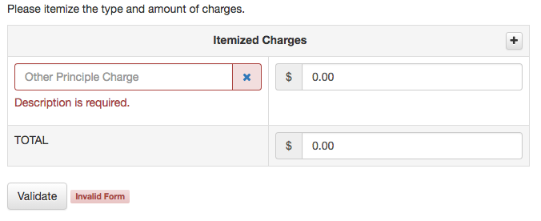

> A jQuery plugin for client-side validation of html forms.
> Under active development.



## Introduction

jquery-prove is a client-side form validation plugin:

- Input [validators](./src/validators) are jQuery plugins.
- Input [decorators](./src/decorators) are jQuery plugins.
- Validators share data with decorators via events.
- Validators can return immediately or can return a deferred validation result.
- Delegated events to the form so the form DOM can be dynamically modified at anytime.
- Explict control over configuration options via [booleanators](#booleanator).
- Modular design via a suite of jQuery [utility plugins](./src/utilities).
- Live and form submit validation.
- Stateful validations.
- Open source MIT license.

Please read [background notes](./BACKGROUND.md) on why yet another jQuery plugin.

## Table Contents
- [Examples](#examples)
- [Options](#prove-options)
- [Validators](#prove-validators)
- [Decorators](#prove-decorators)
- [Methods](#prove-methods)
- [Events](#prove-events)
- [Destroy](#destory)
- [Roadmap](#roadmap)

## Examples

Please see [examples folder](./examples).

## Prove Options

###  Prove Options

Prove accepts only a single options config with only two properties: debug and fields.

```javascript
form.prove({
	debug: false,
	fields: {
		// see fields configuration below
	}
});
```

- `debug`
	- **Type:** bool,
	- **Required:** false,
	- **Default:** false,
	- **Description:** will print out debug info in the developer console.
- `fields`
	- **Type:** object,
	- **Required:** true,
	- **Description:** defines the field validations to be performed. See below for more details.

### Field Options
```javascript
form.prove({
	fields: {
		field1: {
			debug: false,
			enabled: true,
			selector: '[name="field1"]',
			trigger: 'click change',
			stateful: true,
			group: false,
			validators: {
				// see validator options
			}
		},
		field2: {
			// ...
		},
		field3: {
			// ...
		}
	}
});
```

- `debug`
	- **Type:** bool
	- **Required:** false,
	- **Default:** false,
	- **Description:** will print out some debug info in the developer console. Debug defaults to false.
- `enabled`
	- **Type:** booleanator,
	- **Requied:** false,
	- **Default:** true,
	- **Descrption:** will enable the field for validation. A value of ':visible' will only validate the input if the input if visible. A [booleanator](#booleanator) is something (bool, selector, sudo-selector, function) that evaluates to either true or false. So for example, you specify enabled: ':visible' and the field config will be enabled when the input is visible. Or perhaps, enable validation when the input is not empty by setting enabled to ':filled'.
- `selector`
	- **Type:** string,
	- **Required:** false,
	- **Default:** '[name="field"]',
	- **Description:** jQuery selector which you can shift the context of the validation.
- `trigger`
	- **Type:** string or false,
	- **Required:** false,
	- **Default:** 'change keyup click blur',
	- **Description:** The events on which you want to live validation to happen. A value of false will disable live validation.
- `throttle`
	- **Type:** int,
	- **Required:** false,
	- **Default:** 0,
	- **Description:** The number of milliseconds to throttle (aka debounce) live validation.
- `stateful`
	- **Type:** bool,
	- **Required:** false,
	- **Default:** true,
	- **Description:** jquery-prove is a stateful validator. You can disable stateful validation by setting stateful to false. Prove hashes the input value to determine if the input value has changed since last validation. Prove does this stateful validation without keeping a DOM reference to any inputs.
- `group`
	- **Type:** bool,
	- **Required:** false,
	- **Default:** false for all but radio inputs,
	- **Description:** should jquery-prove validate the found inputs as a group or validate the found inputs indivdually.

### Validator Options

Prove has a powerful set of validators. A validator is just a jquery plugin. See [validators](./src/validators) for more information.

```javascript
form.prove({
	fields: {
		field1: {
			validators: {
				proveRequired: {
					debug: true, // optional (bool), defaults to false
					enabled: true, //optional (booleanator), defaults to true
					message: 'Message to pass to the decorator.'
				},
				provePattern: {
					regex: /^[my regex pattern]$/,
					message: 'Message to pass to the decorator'
				},
				// ...
			}
		},
		field2: {
			// ...
		},
		field3: {
			// ...
		}
	}
});
```
Each validator has it's own set of options but below is a set of the common options to all prove validators.
- `debug`
	- **Type:** bool,
	- **Required:** false,
	- **Default:** false,
	- **Description:** Will enalbe the validator to print debug information in the developer console.
- `enabled`
	- **Type:** booleanator,
	- **Required:** false,
	- **Default:** true,
	- **Description:** enable or disable validation depending on the value of the booleanator.
- `message`
	- **Type:** string,
	- **Required:** true,
	- **Description:** This string is passed into the validator which allows your custom validators to modifiy it. Utlimately, this string value is passed to the decorators via the event data.

## Prove Validators

Prove validators are handled by jQuery [validator plugins](./src/validators).

## Prove Decorators

Form decoration is handled by jQuery [decorator plugins](./src/decorators).

## Prove Methods

The form will automatically be validated when the user clicks the submit button. However, you can programatically validate the form from your code via:
```javascript
form.validate();
```
Your code can also validate an input.
```javascript
input.validate();
```

## Prove Events

Prove is a publisher of events. Events are triggered on either the input or the form to share data with the decorators.
- [status.form.prove](./EVENTS.md#) - triggered on the **form**
- [status.input.prove](./EVENTS.md#) - triggered on the **input**

Please see [events](./EVENTS.md) for more details.

## Form Submission

todo: document submit intercept options here.

Should you want to stop the normally form submittion you will need to bind a handler to the form submit event:

```javascript
form.submit(function(event){
	event.preventDefault(); // stop form submit

	//do something else, like ajax submission of form
});
```

## Destroy

You can remove the Prove plugin by either:

```javascript
form.data('prove').destroy();
```
or

```javascript
form.remove();
```

## Contributing

### Setup

```bash
npm install grunt
npm install grunt-eslint
npm install grunt-contrib-concat
npm install grunt-contrib-uglify
```

### Lint
```bash
grunt lint
```

### Build
```bash
grunt build
```

## Roadmap

### Deferred [validators](./src/core/README.md#deferred-validation).

I have deferred validation working, but need to integrate a deferred progress.
```javascript
dfd.notify(data);
```

### Change Event Data

Consider changing `status.input.prove` to `status.input.prove`.

This change would allow for decoration of:
- setup: initialization of prove, which is useful for aria decoration
- validating: start of validation, which is useful for async spinners
- validated: validation completed, which is useful for garland and tinsel

`status.input.prove`
```javascript
{
    field: 'email',
    validator: 'validator', //validator name or undefined
    status: 'validated', //'setup', 'validating', 'progress', 'validated', 'destroy'
    validation: 'success', //'success', 'danger', 'warning', 'reset' //consider 'default' instead of 'reset'?
    message: 'Your error or warning message.'
}
```
Where `status`:
- `setup` - triggered on field setup
```javascript
{
	field: 'email',
	status: 'setup'
}
```
- `validating` - triggered at start of validation
```javascript
{
	field: 'email',
	status: 'validating',
}
```
- `progress` - triggered periodically by a deferred validator
```javascript
{
	field: 'email',
	validator: 'validatorName',
	status: 'progress'
}
```
- `validated` - triggered after input validation
```javascript
{
	field: 'email',
	validator: 'validatorName',
	status: 'validated',
	validation: 'success', //'danger', 'warning', 'reset',
	message: 'Validation message or error code'
}
```
- `destroy` - triggered immediately before input teardown which part of the form.prove('destroy')
```javascript
{
	field: 'email',
	status: 'destroy',
}
```

### Unobtrusive Configuration

Perhaps support unobtrusive configuration via $.fn.proveConfig().
```javascript
var options = form.proveConfig();
form.prove(options);

// or if you dynamically insert an input, but for some reason did not already config the field
input.proveConfig();
```

### Unit Tests

### Reset Input and Forms

Reset input or form
```javascript
input.resetField()
input.trigger('reset.input.prove')
form.trigger.('reset.form.prove')
```

### FAQ

Create an FAQ of frequenty asked questions and answers.


